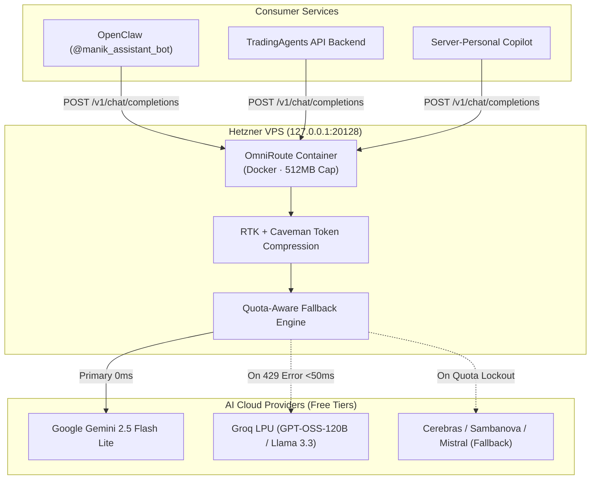

# Project Plan: OmniRoute AI Gateway Deployment & Integration

> **Document ID:** `docs/PLAN-omniroute-gateway.md`  
> **Target Host:** Hetzner Cloud VPS CX23 (`2.28.118.15` · Ubuntu 24.04 LTS)  
> **Status:** Planning Phase (No code execution)  
> **Author:** `project-planner`

---

## 1. Executive Summary & Objective

Deploy **OmniRoute** (`diegosouzapw/OmniRoute`) as a lightweight, containerized AI gateway on the Hetzner VPS. 
OmniRoute will act as the single, universal OpenAI-compatible endpoint (`http://127.0.0.1:20128/v1`) for **OpenClaw**, **TradingAgents**, and **Server Ops**, eliminating rate limits (`HTTP 429 Too Many Requests`) through automated quota-aware fallbacks across 90+ free provider tiers (~1.51B tokens/month) without requiring expensive GPU upgrades.

---

## 2. Host Context & Hardware Constraints

* **Host Machine:** Hetzner VPS CX23 (2 vCPU, 3.8 GB usable RAM, 40 GB NVMe).
* **Current Baseline Usage:**
  * RAM: ~1.4 GB / 3.8 GB in use (~37%).
  * Free RAM Headroom: ~2.4 GB.
  * Docker Engine: Version 29.1.3 active (0 containers running).
* **Hard Constraint:** OmniRoute Docker container must be memory-capped at **`--memory=512m`** with `--memory-swap=768m` to guarantee zero interference with `tradingagents.service` and `openclaw-gateway.service`.
* **Security & Port Binding:** Must bind strictly to `127.0.0.1:20128` (loopback only). No external ports opened in UFW firewall.

---

## 3. Architecture & Data Flow



---

## 4. Phase-by-Phase Task Breakdown

### Phase 1: Container Deployment & Isolation
* **Task 1.1:** Pull stable multi-arch Docker image `diegosouzapw/omniroute:latest` on the VPS.
* **Task 1.2:** Initialize persistent data volume `omniroute-data` for catalog caching and configuration.
* **Task 1.3:** Launch container with strict memory capping and loopback network binding:
  ```bash
  docker run -d \
    --name omniroute \
    --restart unless-stopped \
    --stop-timeout 40 \
    --memory=512m \
    -p 127.0.0.1:20128:20128 \
    -v omniroute-data:/app/data \
    -e OMNIROUTE_MEMORY_MB=512 \
    diegosouzapw/omniroute:latest
  ```
* **Task 1.4:** Verify HTTP health check: `curl -s http://127.0.0.1:20128/health` or `/v1/models`.

### Phase 2: Credentials & Quota Fallback Configuration
* **Task 2.1:** Inject existing Google Gemini and Groq API keys into OmniRoute pool via `/app/data/config.json`.
* **Task 2.2:** Configure fallback priority chain:
  1. `google/gemini-2.5-flash-lite` (Primary free tier)
  2. `groq/openai/gpt-oss-120b` (Instant fallback on 429 rate limit)
  3. `groq/qwen/qwen3.8-27b` (Secondary fallback)
* **Task 2.3:** Enable prompt token compression (`RTK` + `Caveman`) to reduce token consumption by 15–80%.

### Phase 3: Consumer Integration
* **Task 3.1 (OpenClaw):**
  * Update `/home/clawbot/.openclaw/openclaw.json` model provider to point to `http://127.0.0.1:20128/v1`.
  * Restart `openclaw-gateway.service` and verify Telegram response over gateway.
* **Task 3.2 (Server-Personal Dashboard):**
  * Register `omniroute` Docker container in `server-personal/backend/app.py` under monitored services list.
  * Add visual container status, memory usage, and restart trigger to the **"Host & Services"** dashboard.
  * Update `AIChat` copilot backend to route through OmniRoute.

---

## 5. Risk Assessment & Mitigations

| Identified Risk | Severity | Mitigation Strategy |
| :--- | :--- | :--- |
| **V8 Heap Memory Exhaustion** | Medium | Cap container at `--memory=512m` and set `OMNIROUTE_MEMORY_MB=512`. Set Docker restart policy `unless-stopped`. |
| **Port Exposure to Internet** | High | Bind explicitly to `127.0.0.1:20128:20128` (never `0.0.0.0`). Verified blocked by UFW default deny policy. |
| **Fallback Latency Overhead** | Low | Local loopback request overhead is <2ms. In case of 429, fallback occurs in <50ms. |

---

## 6. Verification & Acceptance Checklist

- [ ] Docker container `omniroute` running in `active (running)` state.
- [ ] RAM overhead of container verified <300 MB (`docker stats --no-stream`).
- [ ] `curl -s http://127.0.0.1:20128/v1/models` returns populated provider catalog.
- [ ] Test prompt sent to `http://127.0.0.1:20128/v1/chat/completions` responds in <0.5s.
- [ ] Force 429 simulation triggers automatic fallback to Groq without error returned to caller.
- [ ] Telegram bot `@manik_assistant_bot` successfully replies through OmniRoute.
- [ ] `server-personal` web UI displays OmniRoute health and container controls.
